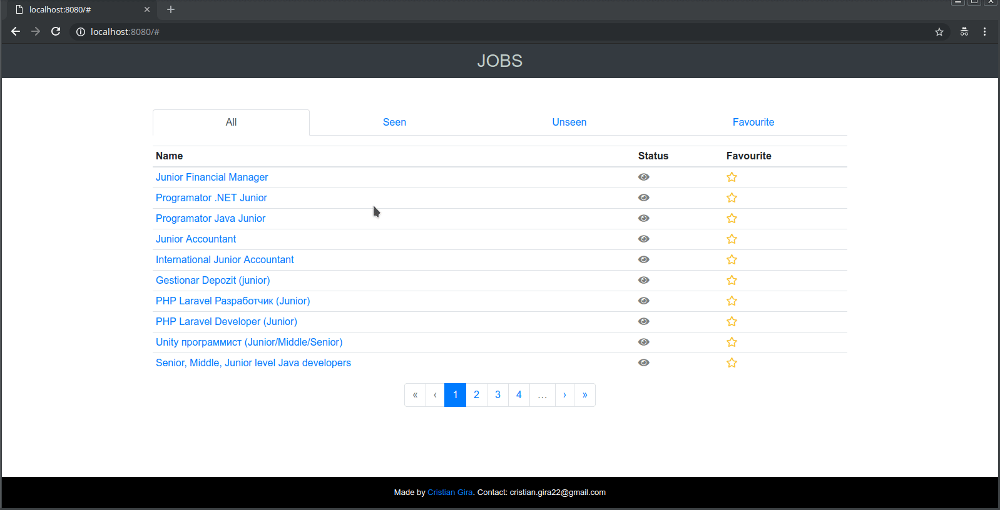

# Jobs-Finder

Scrapes job offers from https://www.rabota.md/ to facilitate a faster way to find
suitable vacancies. It has been built using the following technologies:

- **Flask** for building the REST API backend
- **VueJS** as a frontend framework for client
- **MySQL** as the storage 
- **Docker & docker-compose** on the infrastructure for communication between all services

### Features 

- Filter jobs by viewing status (all, seen, unseen)
- Possibility to mark jobs as favourite

### Prerequisites

- Docker >= 18.09.6
- docker-compose >= 1.25.0

### Installation
- Clone the repository and and `cd` into it 

```
$ git clone git@github.com:cr1g/jobs-finder.git
$ cd jobs-finder
```

- Start the application using docker-compose

```
$ docker-compose up --build -d
```

- Open `http://localhost:8080` on your browser

### Demo
